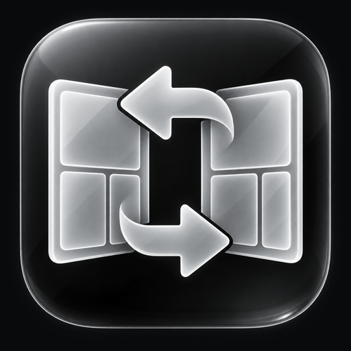

<p align="center">
  
</p>

<h1 align="center">Reverse Panels</h1>

<p align="center"><b>Read your way.</b><br>
A native iPhone and iPad comic reader for your own library: Kavita, OPDS, Nextcloud, iCloud Drive, and local files.</p>

<p align="center">
  <a href="https://github.com/josh-eg112/reverse-panels/releases/latest">Download the beta</a> ·
  <a href="#install">Install</a> ·
  <a href="https://github.com/josh-eg112/reverse-panels/issues/new/choose">Report a bug</a>
</p>

> **Public beta.** Reverse Panels is in active development and is distributed for sideloading only;
> it is not on the App Store yet. Expect rough edges, and please report them.

## Features

- **Panel Flow.** Guided panel-by-panel reading that zooms to each panel in order, left-to-right
  or right-to-left (manga). An on-device panel detector finds panels that classic edge detection
  misses. It runs entirely on your device, and you can turn it off in Settings → Experimental.
- **Full-page reading** with smooth zoom, page scrubbing, and an immersive mode that hides the
  controls.
- **Your library, your servers.**
  - [Kavita](https://www.kavitareader.com): browse libraries, series, and issues, search, and
    continue where you left off.
  - Any **OPDS** catalog.
  - **Nextcloud** (WebDAV), **iCloud Drive**, and files on the device.
- **CBZ, CBR, and PDF** comics.
- **Offline reading.** Download issues and read without a connection.
- **Continue Reading, Favorites, and pinned locations** on the Library home screen.
- **Native and accessible.** SwiftUI, light and dark appearance, Dynamic Type, and VoiceOver
  labels throughout.

## Install

Reverse Panels needs **iOS or iPadOS 17 or later**. It is distributed as an unsigned `.ipa`, so a
sideloading tool signs it with your own Apple ID.

### Option A: SideStore or AltStore (recommended; updates arrive automatically)

1. Install [SideStore](https://sidestore.io) or [AltStore](https://altstore.io).
2. Add this source:

   ```
   https://josh-eg112.github.io/reverse-panels/apps.json
   ```

3. Install **Reverse Panels** from the source. New betas then show up as updates.

### Option B: Download the IPA

Download the latest `.ipa` from [Releases](https://github.com/josh-eg112/reverse-panels/releases/latest)
and install it with Sideloadly, AltStore, SideStore, or a similar tool.

With a free Apple ID, sideloaded apps must be refreshed every 7 days. SideStore and AltStore can
do this automatically.

## Connecting to Kavita

In **Settings → Servers**, add your Kavita URL and an **Auth Key** created in Kavita under your
user settings. The key is stored only in the iOS Keychain on your device.

- **On your home network**, plain `http://` addresses work, for example `http://192.168.1.20:5000`
  or `http://kavita.local:5000`. iOS asks once for permission to access the local network.
- **Away from home**, use `https://`, for example through Tailscale, Cloudflare Tunnel, or a
  reverse proxy with a certificate. iOS blocks plain HTTP to internet addresses.

## Privacy

Reverse Panels has no accounts, analytics, ads, or tracking. It talks only to the servers and
storage you add. Credentials stay in the Keychain on your device, and reading progress and
downloads stay on your device or your own server. See [PRIVACY.md](PRIVACY.md).

## Beta feedback

- **Bugs:** [open a bug report](https://github.com/josh-eg112/reverse-panels/issues/new?template=bug_report.yml).
  Include your device, iOS version, and source type (Kavita, OPDS, and so on).
- **Ideas:** [suggest a feature](https://github.com/josh-eg112/reverse-panels/issues/new?template=feature_request.yml).
- Please don't post server URLs, Auth Keys, or passwords in issues.

See [CHANGELOG.md](CHANGELOG.md) for what changed in each beta.

## License and notices

Copyright © 2026 josh-eg112. All rights reserved. This repository distributes beta builds for
personal use. Source code is not published at this time. Third-party components and their licenses
are listed in [NOTICES.md](NOTICES.md).

Reverse Panels is an independent project. It is not affiliated with Kavita, Nextcloud, or Apple.
